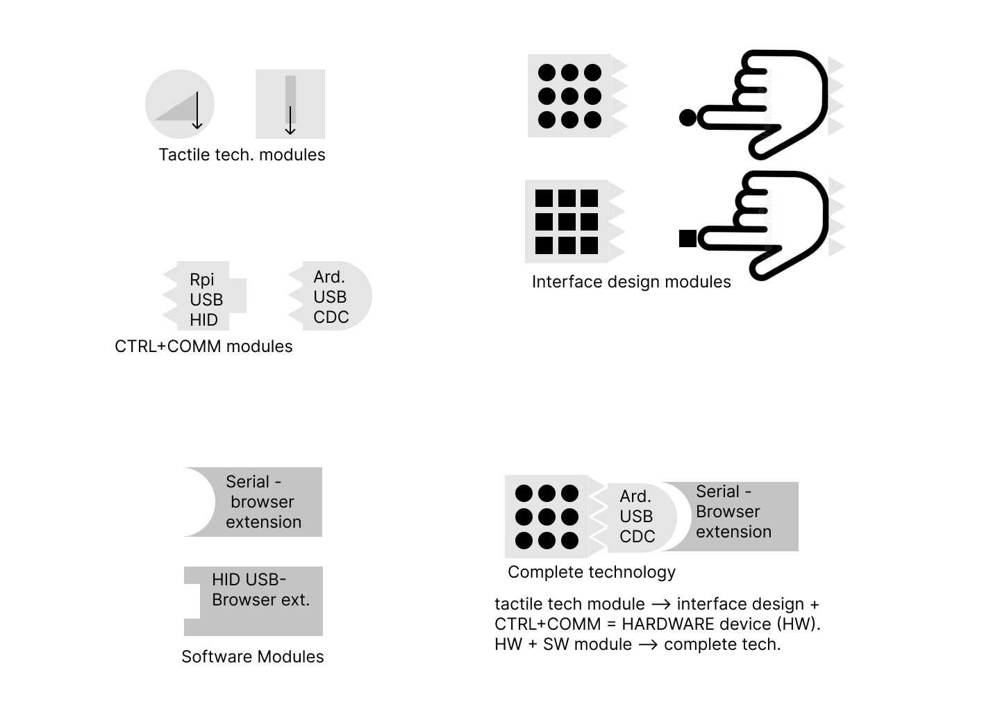

# R&D

## Approach

To make our technology as accessible as possible, our development process [prioritizes](//profile/README.md#r--d) openness, modularity, affordability, ease of use, construction, and modification over performance, aesthetics, or size.

A participatory design approach is preferred when possible: involving the target users from the beginning of any project, and recognizing them as experts in their own experiences and needs.

We encourage everyone to be open about their ideas and seek feedback from the community throughout their development process.

However, if you are passionate about creating a marshmallow-roasting flamethrower with tactile feedback in your basement, please feel free to adapt our projects to your needs and do whatever you feel is best for the project and yourself.
We would love to see a picture of a marshmallow-roasting flamethrower with tactile feedback, by the way!

## Goals:

The first goal of development will be the codesign, construction, and user testing of the [tactile-navigator]()(pending). It is the [project](https://societeinclusive.ca/en/projets/dispositif-assistance-navigation/) for my doctoral thesis and has been developed based on academic research, user experiments, years of efforts, and the [partnership](../profile/README.md# acknowledgment) of multiple universities, research centers, and community organizations.
This very early prototype embodies the [R&D approach](#approach) of LibreTactile, and as such, there is plenty of potential for contribution.

The second goal will be to adapt this technology to benefit other fields like XR, gaming, neuro rehab, multimodal communication, music learning, etc.

The third goal will be to design, manufacture and distribute different "consumer ready" tactile interfaces (as affordable as possible).

These are my priorities for now, and progress will likely be made in parallel some of the time.

## Current projects

Our projects are as modular as possible, so everything will be interconnectable, to maximize the reusability of components between projects.

The projects are built from a few base repositories: stimulation mechanisms, interface designs, control and communication modules, and software plug-ins.

The following diagram illustrates this principle:

> A complete project is made of hardware and software components. The **hardware component** is made up of an arrangement (interface design) of stimulation points (stimulation mechanism module) controlled by a microcontroller (control and communication module). The **software** module is an application, browser extension, plug-in, or library that controls the behavior of the hardware component and enables advanced functionalities.

### **Tactile Navigator**

An assistive technology device to help visually impaired users navigate the internet.

1.  Open **hardware** modules:
    1. Stimulation mechanism: Tact-out/stim-sma - Tactile stimulation point driven by shape memory alloy wire.
    2. Interface design: Tact-matrix: A tactile stimulation matrix made up of multiple tactile stimulation points.
    3. Control and communication: Arduino USB CDC control module.
2.  Open **software** modules:
    1. Tactile Navigator Web browser extension. A chrome extension that extracts the hierarchy of a webpage and sends it to the serial port (to be displayed by the tactile navigator hardware).

### **Tactile VR Glove**

A tactile interface to bring tactile stimulation to VR experiences.

1.  Open **hardware** modules:
    1. Stimulation mechanism: Tact-out/stim-sma - Tactile stimulation point driven by shape memory alloy wire.
    2. Interface design: Tact-glove: A tactile stimulation glove made up of multiple tactile stimulation points adapted to fit the fingers.
    3. Control and communication: Arduino USB CDC control module.
2.  Open **software** modules:
    1. Plug-in for Unity3D.

## Future projects

1.  Open **hardware** modules:
    1. Stimulation mechanisms:
       1. Optimization of shape memory alloy actuator.
       2. Experimentation with another driving mechanism (electromechanical, piezoelectric, etc).
    2. Interface designs:
       1. Stimulate patches of skin.
       1. Braille cells.
    3. Control and communication:
       1. USB HID controller (i.e. raspberry pi pico).
       2. WIFI/Bluetooth.
1.  Open **software** modules:
    1. Compatibility with other operating systems and mobile.
    2. Tighter integration with JAWS/NVDA.
    3. AI functionalities for assistive technology ( summarization, image description, structure from formating, automated navigation agent & WARIA regions, etc.).
    4. Implementation in other apps: Plug-in for books/pdf, excel/tables, programming, gaming, video-tactile calls.
